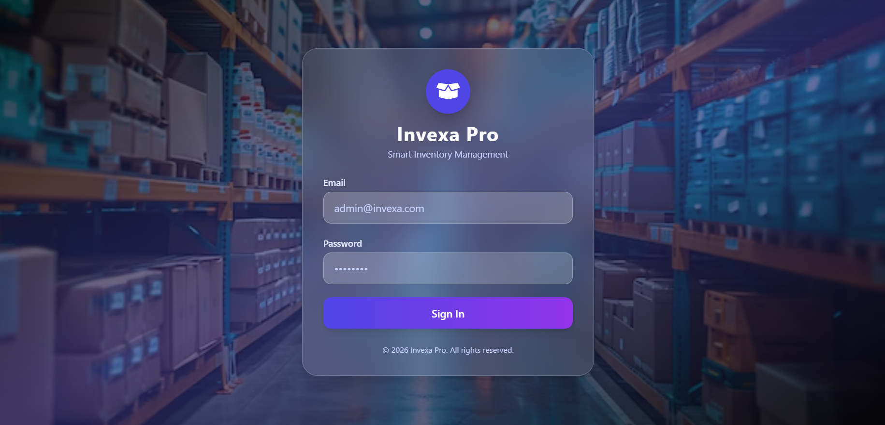
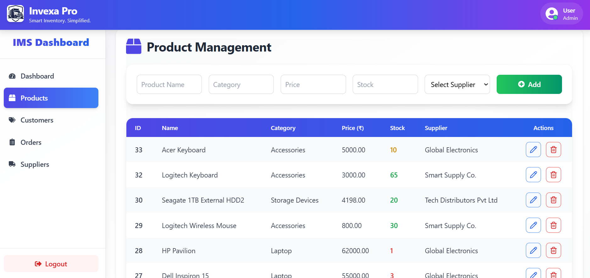
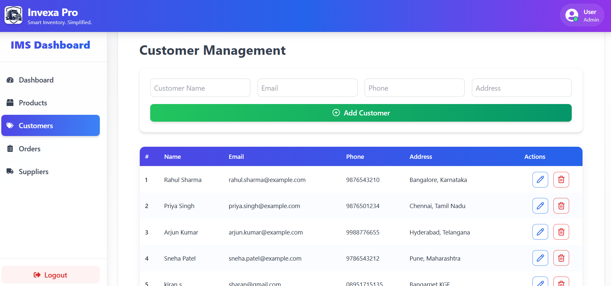
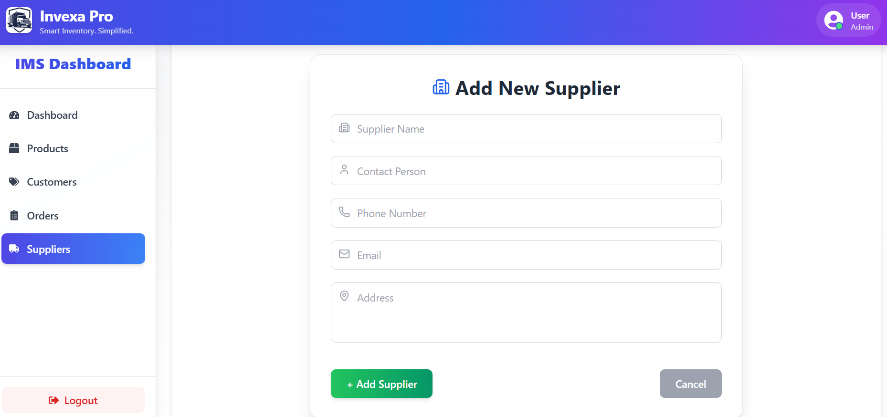
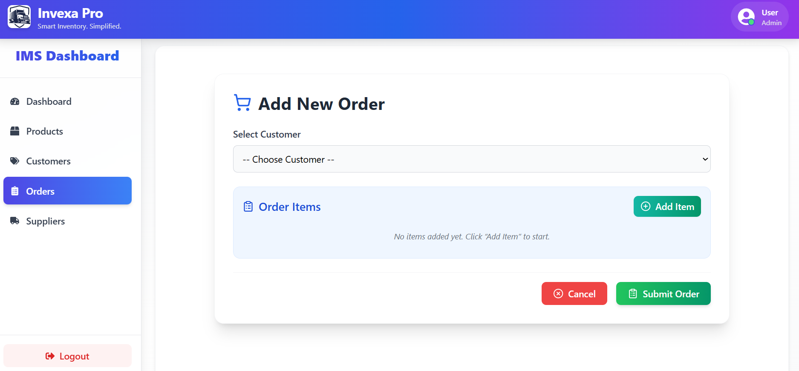
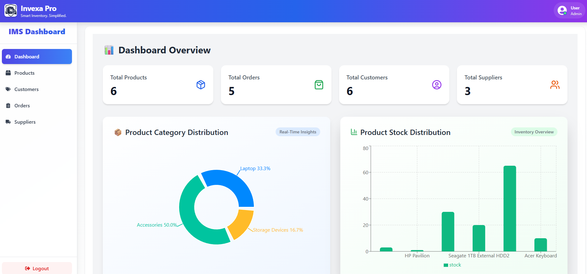

# Invexa Pro – Inventory Management System

Invexa Pro is a full-featured Inventory Management System designed to help businesses efficiently manage products, customers, suppliers, and orders with secure role-based access for Admin and Staff users. The system supports complete CRUD operations and provides a clean, modern interface for day-to-day inventory operations.

---

## 🚀 Features

### 🔐 Authentication & Authorization

* Secure login system
* Role-based access control

  * **Admin**: Full system access

### 📦 Product Management

* Add, view, update, and delete products
* Manage product details such as name, price, quantity, and category
* Stock tracking and updates

### 👥 Customer Management

* Maintain customer records
* CRUD operations for customer details
* Easy association of customers with orders

### 🚚 Supplier Management

* Manage supplier information
* CRUD operations for suppliers
* Track suppliers linked to products

### 🧾 Order Management

* Create and manage orders
* Assign customers and products to orders
* Update order status
* View order history

### ⚙️ Admin Panel

* Manage users (Admin / Staff)
* Monitor system activities
* Full control over all modules

---

## 🛠️ Tech Stack

**Frontend**

* React.js
* Tailwind CSS (modern responsive UI)

**Backend**

* Node.js
* Express.js

**Database**

* MySQL 

**Other Tools & Libraries**

* Axios for API communication
* JWT for authentication

---

## 📸 Screenshots

Add screenshots of your application UI below to showcase the system.

### 🔑 Login Page

### 📦 Product Management

### 👥 Customer Management

### 🚚 Supplier Management

### 🧾 Order Management

### ⚙️ Admin Dashboard

## ✅ Future Enhancements

* Role-based permission customization
* Reports and analytics dashboard
* Invoice generation (PDF)
* Email notifications
* Product image uploads

---

## 👨‍💻 Author

**Sharan M**
CSE 

---

## 📄 License

This project is for educational and portfolio purposes.
